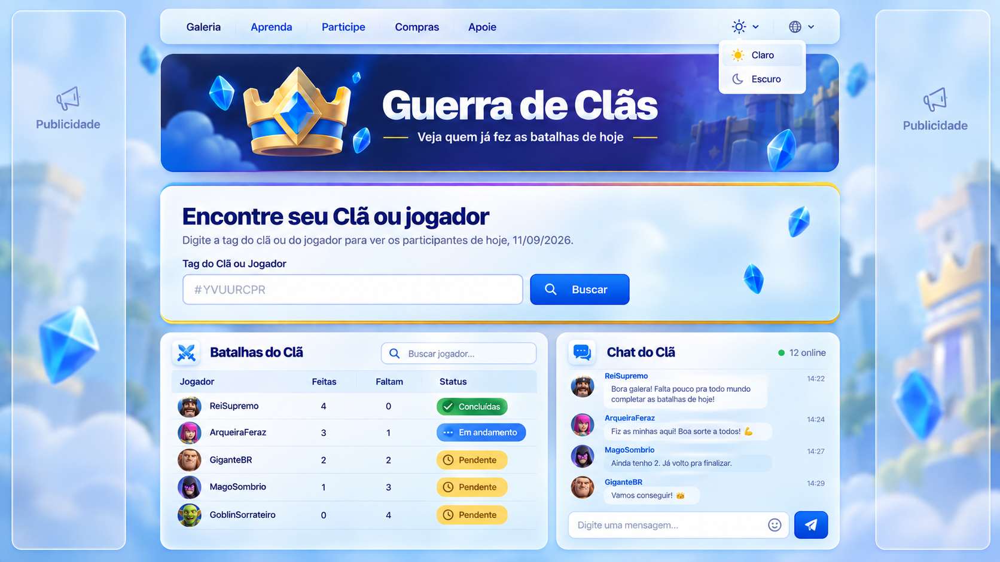

<div align="center">

[](README.md)
[](README.en-us.md)
[](README.es-419.md)
[](README.zh-cn.md)

[](https://github.com/Andrehlb)
[](https://github.com/Andrehlb#contact)

</div>

# GC — Guerra de Clãs

Aplicação web para consultar e acompanhar a participação dos membros de um clã nas Guerras de Clãs do Clash Royale. O backend usa Node.js com Express, consome a API oficial da Supercell e aplica as regras de negócio da participação na guerra.

O projeto nasceu de uma necessidade real dentro do meu clã: acompanhar, de forma simples e clara, quem realizou as batalhas do dia e quem ainda possui batalhas pendentes.

O frontend original, desenvolvido com HTML, CSS e JavaScript, continua disponível enquanto uma nova interface é construída gradualmente com Next.js, React e TypeScript. A migração está sendo feita sem transferir para o frontend responsabilidades que pertencem ao backend.

## Protótipo da nova interface

A concepção visual e a definição funcional da nova interface foram realizadas antes da implementação em código, registrando a direção adotada para a evolução do projeto.

**Concepção e definição funcional:** André Luiz Barbosa  
**Versão do protótipo:** 1  
**Data:** 11/09/2026

O layout prevê pesquisa pública por clã ou jogador, acompanhamento das batalhas, perfil individual, chat do clã, temas claro e escuro, suporte a vários idiomas e espaços publicitários isolados da área funcional.

A pesquisa de clã e jogador será independente do chat. As pesquisas públicas não exigirão cadastro ou login. O chat será uma funcionalidade autenticada: a conta do usuário deverá possuir uma `playerTag` vinculada e validada, e o acesso será associado ao clã atual do jogador.



## Tecnologias e habilidades desenvolvidas


Durante o desenvolvimento, são aplicadas e desenvolvidas habilidades de:

- integração com API externa;
- requisições HTTP e interpretação de status;
- autenticação por token;
- programação assíncrona com `async/await` e `fetch`;
- criação de endpoints REST;
- tratamento e transformação de dados;
- separação entre Routes, Controllers, Services e Repositories;
- React, Next.js, TypeScript e App Router;
- CSS Modules e responsividade;
- acessibilidade de interface;
- filtragem e apresentação de dados no frontend;
- configuração com variáveis de ambiente;
- versionamento com Git e GitHub;
- preparação e operação de infraestrutura em nuvem.

## Objetivo

O sistema ajuda o clã a acompanhar o nome de cada jogador, quantas batalhas foram realizadas, quantas ainda restam, a situação da participação e se a River Race está no período de treinamento ou de guerra.

Os dados dos membros e da River Race são reunidos, processados e apresentados em uma interface web, evitando que o usuário precise interpretar diretamente as respostas da API.

## Funcionalidades atuais

- Consulta da guerra atual.
- Busca dinâmica por tag de clã usando `clanTag`.
- Consulta dos membros do clã.
- Consulta da River Race atual.
- Cruzamento dos dados pela tag do jogador.
- Cálculo das batalhas realizadas e restantes.
- Identificação do período de treinamento ou guerra.
- Filtro de jogadores por nome ou tag.
- Exibição da participação dos jogadores.
- Área de contribuição voluntária por PIX.
- Endpoint REST para consumo pelo frontend.

## Nova interface em desenvolvimento

A nova interface está sendo construída em `frontend/` com Next.js, React e TypeScript.

Decisões já definidas:

- App Router para organização das páginas;
- CSS Modules para estilização;
- exportação estática para `frontend/out`;
- nenhum clã deve ser carregado automaticamente ao abrir a página;
- nenhum jogador fictício deve aparecer como dado real;
- pesquisa pública por clã ou jogador;
- temas claro e escuro;
- suporte a vários idiomas;
- acessibilidade e responsividade;
- perfil individual de jogador;
- futuro chat autenticado do clã;
- anúncios isolados da área funcional;
- manutenção do frontend antigo até a nova interface atingir equivalência funcional.

## Instalação

Pré-requisitos:

- Node.js 18 ou superior;
- npm;
- token válido da API da Supercell.

Na raiz do projeto:

```bash
npm install
npm start
```

Por padrão, o backend fica disponível em:

```text
http://127.0.0.1:3000
```

O novo frontend possui dependências e processo de build próprios dentro de `frontend/`.

## Configuração

Crie um arquivo `.env` na raiz do projeto. Ele contém configurações locais e não deve ser versionado.

```env
PORT=3000
HOST=127.0.0.1
APP_NAME=GC Guerra de Clãs
APP_CONTEXT=API
SUPERCELL_API_TOKEN=
CLAN_TAG=#YVUURCPR
```

- `PORT`: porta do servidor Express; padrão `3000`.
- `HOST`: endereço de escuta; padrão `127.0.0.1`.
- `APP_NAME`: nome da aplicação; padrão `GC ⚔️ Guerra de Clãs`.
- `APP_CONTEXT`: contexto exibido pela resposta HTML de fallback; padrão `API`.
- `SUPERCELL_API_TOKEN`: token usado pelo backend para autenticar na API da Supercell.
- `CLAN_TAG`: configuração existente no backend. A nova interface não deve usar esse valor para carregar automaticamente um clã ao abrir a página.

O arquivo `.env` não deve ser versionado e o valor de `SUPERCELL_API_TOKEN` nunca deve ser publicado. A chave criada no portal da Supercell também precisa autorizar o endereço IP da máquina que executa a aplicação.

## Como usar

No frontend atual:

1. acesse a aplicação;
2. informe a tag do clã;
3. inicie a consulta da guerra atual;
4. visualize a lista e a participação dos jogadores;
5. se necessário, filtre um jogador pelo nome ou pela tag.

Uma nova busca por clã envia `clanTag` ao backend e solicita dados atualizados à Supercell.

## Endpoints

### Participação atual na guerra

```http
GET /war-members/current
GET /war-members/current?clanTag=%23YVUURCPR
GET /war-members/current?playerTag=%23PLAYER
```

- `clanTag` escolhe o clã consultado.
- Quando `clanTag` é omitido, o backend mantém o comportamento configurado atualmente.
- `%23` representa o caractere `#` codificado na URL.
- `playerTag` permite consultar ou filtrar um jogador no endpoint.

Formato da resposta:

```json
{
  "clan": {
    "name": "Nome do clã",
    "tag": "#YVUURCPR"
  },
  "members": [
    {
      "tag": "#PLAYER",
      "name": "Jogador",
      "battlesDone": 4,
      "battlesMissing": 0,
      "status": "✅ fez todas as batalhas"
    }
  ]
}
```

Outros endpoints existentes incluem `GET /health` e `GET /clans`.

## Regras de negócio

- Segunda, terça e quarta correspondem ao período de treinamento.
- Quinta, sexta, sábado e domingo correspondem ao período de guerra.
- Durante a guerra, cada jogador pode usar até quatro decks por dia.
- O sistema calcula `battlesDone`, `battlesMissing` e um texto de `status`.
- No período de treinamento, não é registrada pendência de batalhas da guerra.

Exemplo:

```text
Jogador       Fez   Restam   Status
SwordFish      4      0      ✅ fez todas as batalhas
Fernando       3      1      ⚠️ falta 1 batalha
Jogador X      0      4      ⏳ faltam 4 batalhas
```

## Integração com a Supercell

Para cada consulta, o backend acessa:

```http
GET /v1/clans/{clanTag}/members
GET /v1/clans/{clanTag}/currentriverrace
```

A autenticação na API externa é feita por token. O repository consulta os recursos necessários, o service cruza os dados pela tag do jogador e transforma o resultado na resposta usada pelo frontend. O acesso externo possui tratamento específico para os status HTTP `401` e `403`.

## Arquitetura

Backend atual:

```text
Frontend → Routes → Controllers → Services → Repositories → API da Supercell
```

Responsabilidades:

- `Frontend`: apresentação e interação com o usuário;
- `Routes`: definição dos endpoints HTTP;
- `Controllers`: leitura dos parâmetros e construção das respostas HTTP;
- `Services`: regras de negócio e transformação dos dados;
- `Repositories`: acesso à API da Supercell e aos dados locais.

A nova interface mantém essa separação: o Next.js será responsável por apresentação, interação, acessibilidade, responsividade, temas e idiomas, enquanto o Express continuará responsável por consultas, regras de negócio, processamento e integração com a API da Supercell.

## Chat do clã — arquitetura planejada

O chat ainda é uma funcionalidade futura e será separado das pesquisas públicas.

Regras já definidas:

- pesquisa de clã e jogador sem obrigatoriedade de login;
- cadastro e login necessários apenas para funcionalidades autenticadas, como o chat;
- `playerTag` poderá ser usada nas pesquisas públicas e também vinculada à conta;
- o backend deverá validar a `playerTag` e identificar o clã atual do jogador;
- o usuário só poderá acessar o chat do clã ao qual pertence;
- a permanência no chat deverá acompanhar a composição atual do clã;
- quando o jogador deixar o clã, o acesso correspondente deverá ser revogado;
- autenticação, autorização, sessão, moderação, armazenamento e atualização em tempo real serão definidos antes da implementação do backend do chat.

## Uso responsável de IA no desenvolvimento

Uso Inteligência Artificial como ferramenta de apoio para análise, implementação, revisão, testes e documentação, mantendo sob minha responsabilidade as decisões técnicas e o código incorporado ao projeto.

Antes de aceitar uma sugestão gerada por IA, reviso sua lógica, arquitetura, dependências, tratamento de erros, segurança, impacto no código existente e testes aplicáveis. Não forneço senhas, tokens, chaves de API, dados pessoais ou outros segredos do projeto às ferramentas de IA.

O objetivo é usar IA para aumentar produtividade e qualidade sem substituir a compreensão do código, o code review, os testes e a responsabilidade do desenvolvedor.

## Apoie o projeto

Se este projeto ajuda seu clã a acompanhar a participação na guerra, você pode contribuir para manter o site online e apoiar sua evolução. A contribuição é voluntária e pode ser feita pela área de doação disponível na própria aplicação.

## Implantação

A arquitetura de produção utiliza Oracle Cloud Infrastructure e Nginx. O novo frontend foi preparado para exportação estática em `frontend/out`, preservando o backend Express como serviço responsável pela API e pelas regras de negócio.

Informações de acesso público só devem ser documentadas aqui depois de validadas como parte do fluxo de publicação.

## Estado atual e próximas etapas

Concluído no desenvolvimento da nova interface:

- preparação segura e conferência das alterações anteriores;
- remoção do carregamento automático de clã na interface;
- definição da arquitetura com Next.js, React, TypeScript e CSS Modules;
- criação da aplicação Next.js em `frontend/`;
- validação com ESLint e build;
- configuração da exportação estática para `frontend/out`;
- definição e registro do protótipo visual versão 1;
- definição dos ativos visuais principais: coroa, cenário do cabeçalho e fundo claro.

Etapa atual:

```text
Etapa 5 — Preparar os ativos visuais
└── 5.2 Salvar e conferir as imagens
```

Arquivos previstos:

```text
frontend/public/assets/crown-royale-original.png
frontend/public/assets/royale-arena-hero.png
frontend/public/assets/royale-page-background-light.png
```

Depois da conferência dos arquivos, a próxima atividade é verificar dimensões, peso, formato, transparência, proporção, qualidade visual e local correto de uso antes de iniciar as alterações de CSS.

## Contribuição

Sugestões e correções podem ser enviadas por issue ou pull request. Não inclua tokens, arquivos `.env` ou outras credenciais.
